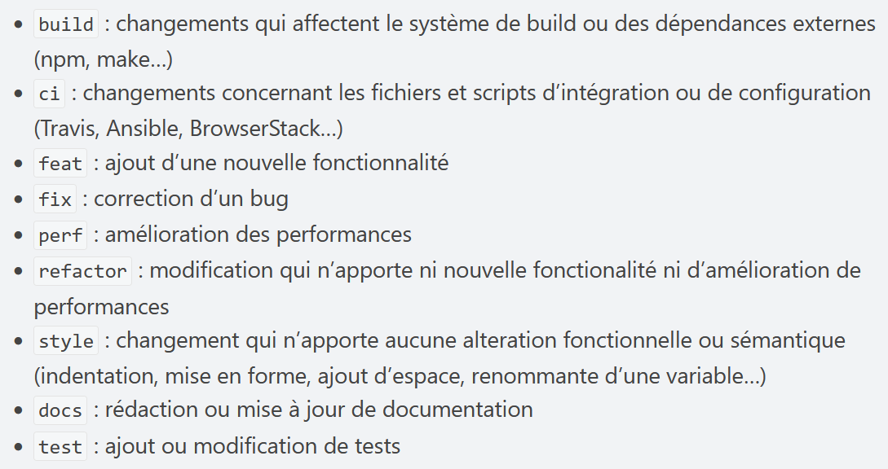

# Ateliers Pédagogiques

Ce dépot a pour but de regrouper les différents sujets d'ateliers ainsi que les potentielles ressources nécessaires.

Les sujets doivent être écrits en LaTeX en suivant le modèle d'exemple. Il est conseillé afin de bien travailler avec Git d'utiliser un éditeur en local possédant un mode de visualisation, comme [TexMaker](https://www.xm1math.net/texmaker/) par exemple.

---
## Contribuer

N'hésitez pas à ouvrir des issues si vous souhaitez proposer des modifications sur un sujet existant.

Veuillez créer une branche nommée explicitement si vous souhaiter ajouter un nouveau sujet.

Les commits de ce dépot doivent suivre au maximum la convention [Angular](https://www.conventionalcommits.org/en/v1.0.0-beta.4/). Succintement, voici les principaux tags à appliquer : 

---
### Format
Un template d'exemple est disponible (/sujets/template).
Merci de rédiger votre sujet en suivant ce modèle.

Chaque sujet doit contenir quatre parties distinctes :
- **Résumé**, explication rapide de ce qui est traité dans le sujet, des objectifs et finalités.
- **Avant de commencer**, mention des prérequis pour la réalisation du sujet et présentation éventuelle des logiciels/matériels utilisés.
- **Sujet**, le coeur du document se trouve ici, développement de tout le sujet en veillant à hiérarchiser le contenu.
- **Annexes**, liens et documents nécéssaires ou utiles à la réalisation du sujet.

---
*L'ensemble des sujets et contenus présents ici est sauf mention explicite la pleine propriété de l'association **L'Atelier**. Toute reproduction ou copie même partielle de ces documents doit contenir un lien vers ce dépot.*